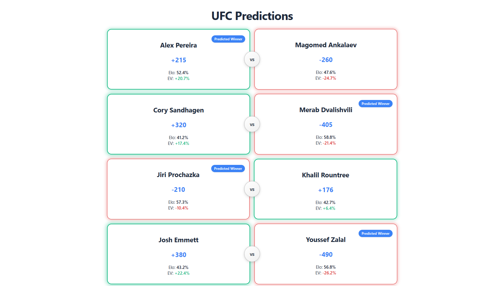

# FightEV — UFC Predictions & Elo Ratings

A clean React + TypeScript web app displaying upcoming UFC fight cards with live sportsbook odds alongside a Python Elo-based win probability & expected value (EV) model. Positive-EV picks are highlighted in green with suggested Kelly unit sizing. The fight card is refreshed automatically on fight weekends, and completed results and Elo ratings are updated every Sunday morning.

If you use this to place your own bets, please do so at your own discretion.

<p align="center">
  
</p>

## Features

- **Live Odds & Implied Probabilities** from The Odds API
- **Round-Calibrated Elo Model** built in Python
- **Expected Value (+EV) Calculation** & highlighted edge cards
- **Quarter-Kelly Criterion** suggested bet unit sizing (`0.5u` – `3.0u`)
- **Interactive Fight History Popups** showing a fighter's last 5 UFC bouts
- **Fighters Directory & Profiles** with weight class division filters and career Elo charts
- **Automated Workflows** on GitHub Actions to refresh cards and update historical Elo ratings weekly

## Tech Stack

- **Frontend:** React, TypeScript, Vite, Framer Motion, Recharts
- **Backend:** Python, FastAPI, SQLite, SQLAlchemy
- **Data & Automation:** Beautiful Soup, The Odds API, GitHub Actions

## Getting Started

```bash
docker compose up --build
```
